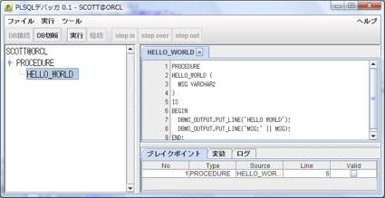
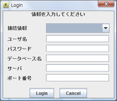
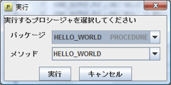
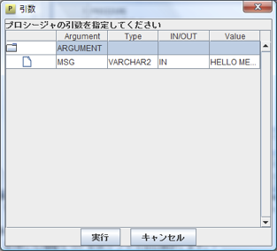
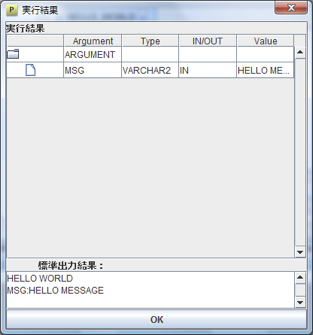

# pdb

PL/SQL デバッガです。
ローカルにデバッグ用のサーバを作成し、Oracle側からJDWP接続を行い、デバッグを行います。

## requirement

- JDK 1.8
- Oracle Database
  - 11g で動作確認済み

## build

Mavenでビルドしてください。

```shell
./mvnw pacakge
```

## run

カレントディレクトリに `pdbconf.xml` を配置し、  jar ファイルを指定して実行します。

```shell
java -jar pdb-0.0.1-SNAPSHOT-jar-with-dependencies.jar
```

### usage

#### メインウィンドウ



##### ソース選択ビュー

接続したスキーマのストアドプロシージャを表示します。
ソース名の右側に赤字で「NoDEBUG」「INVALID」とあるプロシージャについては、そのままでは実行できないため、デバッグコンパイルまたは修正が必要となります。
ダブルクリックでソースを選択します。
また、右クリックでソースの選択、実行、コンパイル、デバッグコンパイルを行うことができます。

##### ソースビュー

ストアドされているソースを参照することができます。
行番号をダブルクリックすることでブレイクポイントを設定します。

##### 情報ビュー

ブレイクポイント、変数、ログを確認することができます。

**ブレイクポイントタブ**

ブレイクポイントを設定しているソース名、種別、行数、VALIDを表示します。無効な行に対してブレイクポイントを設定した場合は、VALIDのチェックが外れます。

**変数タブ**

変数を表示します。CTRL+Cで変数の値をクリップボードにコピーすることができます。

**ログタブ**

ログを表示します。pdbのデバッグ用です。

##### DB接続ボタン

ログインダイアログを表示し、データベースへ接続します。

##### DB切断ボタン

未実装

##### 実行ボタン

実行ダイアログを表示し、プロシージャを実行します。

##### 継続ボタン

停止中のプロシージャを再開します。

##### step in ボタン

ステップ実行を行います。
関数を実行する場合は、関数の中に入っていきます。

##### step over ボタン

ステップ実行を行います。
関数を実行する場合は、関数が終了した後の状態になります。

##### step out ボタン

ステップ実行を行います。
現在の関数を抜けた状態になります。


#### メニュー

##### ファイル

**DB接続**

ログインダイアログを表示しデータベースへ接続します。

**DB切断**

未実装

**終了**

アプリケーションを終了します。

##### 実行

**実行**

実行ボタンと同様

**継続**

継続ボタンと同様

**step in**

step in ボタンと同様

**step over**

step over ボタンと同様

**step out**

step out ボタンと同様

**TRACE**

未実装

##### ツール

**ログレベル\[なし\]**

ログ出力がなくなります。

**ログレベル\[警告\]**

警告レベルのログのみを表示します。

**ログレベル\[情報\]**

警告レベル、情報レベルのログを表示します。

**ログレベル\[詳細\]**

警告レベル、情報レベル、詳細レベルのログを表示します。

**ログレベル\[調査\]**

警告レベル、情報レベル、詳細レベル、調査レベルのログを表示します。

**変数展開**

配列やPL/SQL RECORDのメンバ数が多いと、ステップ実行時の変数解析に時間がかかります。
変数展開を行わないとその処理が省略されるため、ステップ実行時の動作が早くなります。

##### ヘルプ

**ヘルプ**

ヘルプを表示します。

**アバウト**

バージョン情報を表示します。

#### ログインダイアログ



##### 接続情報

pdbconf.xml で設定した接続情報を選択することができます。

##### ユーザ名

ユーザ名を入力します。

例) `scott`

##### パスワード

パスワードを入力します。

例) `tiger`

##### データベース名

データベースの SID を入力します。

例) `orcl`

##### サーバ

Oracleが起動しているサーバ名を入力します。

例) `127.0.0.1`

##### ポート番号

リスナーのポート番号を入力します。通常は `1521` です。

例) `1521`

#### 実行ダイアログ

実行を選択すると、実行ダイアログを表示します。
実行するプロシージャ、メソッドを選択します。



#### 引数入力ダイアログ

実行ダイアログでプロシージャを選択後、引数入力ダイアログでプロシージャに渡す引数を設定します。

本アプリでは、配列、PL/SQL RECORDを引数に渡すことができません。
別途、起動用のプロシージャ（テストドライバ）を作成し、そのプロシージャを本ツールで呼び出してください。




#### 実行結果ダイアログ

プロシージャ終了後、`OUT` パラメータや `DBMS_OUTPUT` で出力した内容を表示します。




### setting

省略

## License

Copyright &copy; 2010 tamura shingo\
Licensed under the [MIT License][MIT].

[MIT]: https://opensource.org/licenses/MIT
